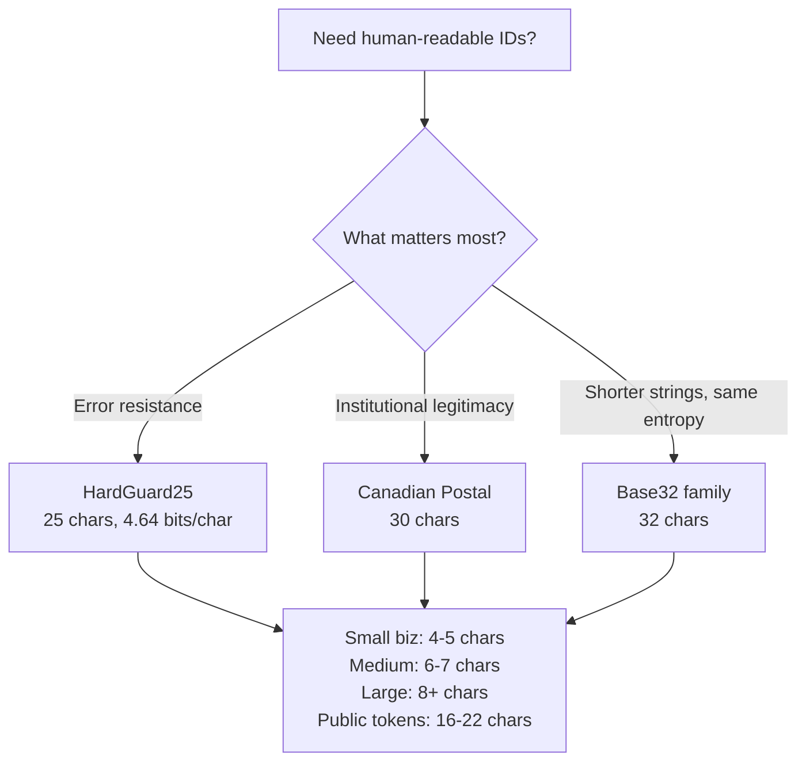

# HardGuard25 Specification

**Version:** 1.3
**Date:** March 2026
**Author:** Sam Rogers -- Snap Synapse
**Spec License:** Creative Commons Attribution 4.0 International (CC BY 4.0)

## Abstract

Identifiers used by humans and machines fail for predictable reasons. Most collisions and transcription errors trace back to ambiguous characters, inconsistent casing, and context-insensitive formatting. HardGuard25 defines a 25-character alphabet optimized for human readability and low error rates while retaining the full 0-9 digit set for natural versioning. This document specifies the character set, normalization rules, recommended lengths by risk profile, an optional check digit, and formatting guidelines. It does not define a global ID format or distributed generation protocol.

## Alphabet

```
0 1 2 3 4 5 6 7 8 9 A C D F G H J K M N P R U W Y
```

25 characters total: 10 digits + 15 letters.

### Canonical Form

- Uppercase only
- ASCII only
- No whitespace, no punctuation

### Regex

```
^[0-9ACDFGHJKMNPRUWY]+$
```

## Rationale for Exclusions

| Removed | Reason |
|---------|--------|
| O | Confusable with 0 (zero) |
| I | Confusable with 1 (one) and lowercase L |
| L | Confusable with 1 (one) and uppercase I |
| B | Confusable with 8; dyslexia mirror pair with D |
| S | Confusable with 5 |
| Z | Confusable with 2 |
| E | Confusable with 3 for dyslexic readers; digits take priority |
| V | Confusable with U in many typefaces |
| T | Resembles a plus sign in some contexts |
| X | Collides with multiplication operator; varies by locale |
| Q | Confusable with O in some typefaces; dyslexia mirror pair with P |

Design principle: when a letter and a digit compete for the same visual slot, the digit always wins.

## Comparison Matrix

| Name | Chars | Bits/char | Key Exclusions |
|------|------:|----------:|----------------|
| HardGuard25 | 25 | 4.64 | I, L, O, B, S, Z, E, T, V, X, Q |
| Canadian Postal | 30 | 4.91 | D, F, I, O, Q, U |
| Nintendo Base-31 | 31 | 4.95 | 0, 1, B, I, O |
| Crockford Base32 | 32 | 5.00 | I, L, O, U |
| z-base-32 | 32 | 5.00 | Custom reorder, drops 0/2 |
| RFC 4648 Base32 | 32 | 5.00 | None (uses A-Z + 2-7) |

## Entropy and Recommended Lengths

Bits per character = log2(25) = 4.64.

| Length | Bits | Unique IDs | Typical Use |
|-------:|-----:|-----------:|-------------|
| 4 | 18.6 | 390,625 | Small inventory, tickets |
| 5 | 23.2 | 9,765,625 | Small business |
| 6 | 27.9 | 244,140,625 | Medium businesses |
| 7 | 32.5 | 6.1 billion | Large catalogs |
| 8 | 37.2 | 152.6 billion | Large systems |
| 12 | 55.7 | 5.96 x 10^16 | Internal tokens |
| 16 | 74.2 | 3.55 x 10^22 | Cross-system IDs |
| 20 | 92.8 | 2.11 x 10^27 | Public tokens |
| 22 | 102.1 | 1.32 x 10^30 | Internet-scale |

Recommended defaults:

- 16 for internal systems up to millions of IDs
- 20 for public tokens or cross-org use
- 22 for long-lived, internet-scale identifiers

## Collision Guidance

Birthday-bound approximation: for alphabet size N and length L, the probability of any collision after generating k IDs is approximately p = 1 - exp(-k^2 / (2 * N^L)).

| Length | Space Size | Max IDs before 1e-9 collision | Max IDs before 1e-12 collision |
|-------:|-----------:|------------------------------:|-------------------------------:|
| 12 | 5.96e16 | 10,918 | 345 |
| 14 | 3.72e20 | 689,957 | 21,823 |
| 16 | 2.33e22 | 6,823,938 | 215,584 |
| 18 | 1.46e25 | 67,627,923 | 2,136,731 |
| 20 | 9.09e27 | 4,264,961,375 | 134,875,910 |
| 22 | 5.68e30 | 106,624,034,378 | 3,371,897,753 |

## Normalization Rules

1. Trim leading and trailing whitespace
2. Collapse any separator characters (hyphens, spaces, underscores, dots)
3. Uppercase fold all letters
4. Reject any character outside the alphabet

A normalizer must be idempotent: `normalize(normalize(x)) === normalize(x)`.

## Optional Check Digit

Use a Mod-25 weighted checksum appended as the last character of the ID.

### Algorithm

1. Assign each character in the alphabet an index 0-24 based on its position in the ordered alphabet: `0=0, 1=1, ..., 9=9, A=10, C=11, D=12, F=13, G=14, H=15, J=16, K=17, M=18, N=19, P=20, R=21, U=22, W=23, Y=24`.
2. Compute a weighted sum: `sum = sum of (index[i] * (i + 1))` for each character position i (0-indexed).
3. The check digit is the alphabet character at index `sum % 25`.
4. Append the check digit as the last character.

### Verification

To verify, strip the last character, recompute the check digit, and compare. A valid ID with check digit has `length >= 2`.

### Properties

- Catches all single-character substitution errors
- Catches most adjacent transpositions
- Adapted from ISO 7064 principles

## Human Formatting

- Group into chunks of 4 or 5 for display: `ACDF-0G7H-J2KM-NP3R`
- Store and transmit without separators
- Never overload O for 0 or I/L for 1
- Use monospaced or semi-monospaced typefaces for printed IDs
- Provide high contrast when displayed on screen or paper

## Implementation Guidance

### Generation

- Use a cryptographically secure pseudorandom number generator (CSPRNG)
- Map random bytes to the alphabet with unbiased rejection sampling
- Do not use modulo 25 directly on raw random bytes; this introduces bias because 256 is not divisible by 25
- Rejection sampling: accept byte values less than 225 (25 x 9), discard the rest, then compute `value % 25`

### Validation

1. Apply normalization
2. Test against regex
3. If check digit is enabled, verify checksum
4. Accept lowercase and separator-filled input only if it normalizes cleanly into canonical form; reject anything outside the alphabet after normalization

### Property-Based Tests

- Generator never emits excluded characters (B, E, I, L, O, Q, S, T, V, X, Z)
- Distribution across symbols is uniform within statistical tolerance
- Normalizer is idempotent
- Check digit catches all single-character substitutions

## Test Vectors

Use these to verify cross-language consistency. These are 16-character IDs generated from the same seed sequence then mapped to HardGuard25 via rejection sampling.

```
Input bytes (hex): 6a 9f 12 88 58 31 d2 44 9b 07 6c 48 2f 5e e1 b3 ...
HardGuard25-16:    AC0G7HJK2MNPR3UW

Input bytes (hex): 3e 1a 77 c4 9d 20 11 55 cb 4a e0 f8 5c 13 a2 6d ...
HardGuard25-16:    D7H2GJ0KMW1PRUYA

Input bytes (hex): b0 45 f2 1c 8e 09 33 4c 6a 70 56 11 d1 a7 2e 90 ...
HardGuard25-16:    0CNG5J7KM2PRUWAH
```

## Accessibility Notes

- Designed for dyslexia-sensitive contexts by avoiding common confusable pairs
- Works well in OCR contexts with OCR-A and similar monospaced fonts
- Avoid thin, condensed, or highly stylized typefaces for printed IDs
- Provide chunking and high contrast when displayed

## References

- RFC 4122: A Universally Unique Identifier (UUID) URN Namespace
- RFC 4648: The Base16, Base32, and Base64 Data Encodings
- Crockford, Douglas: Base32 Encoding
- Zooko Wilcox-O'Hearn: z-base-32 encoding
- Nintendo Switch friend code documentation (Base-31)
- Canada Post: Postal Code format guidelines
- Dyslexia and human factors research on alphanumeric confusability
- OCR-A and machine-readable typeface standards


